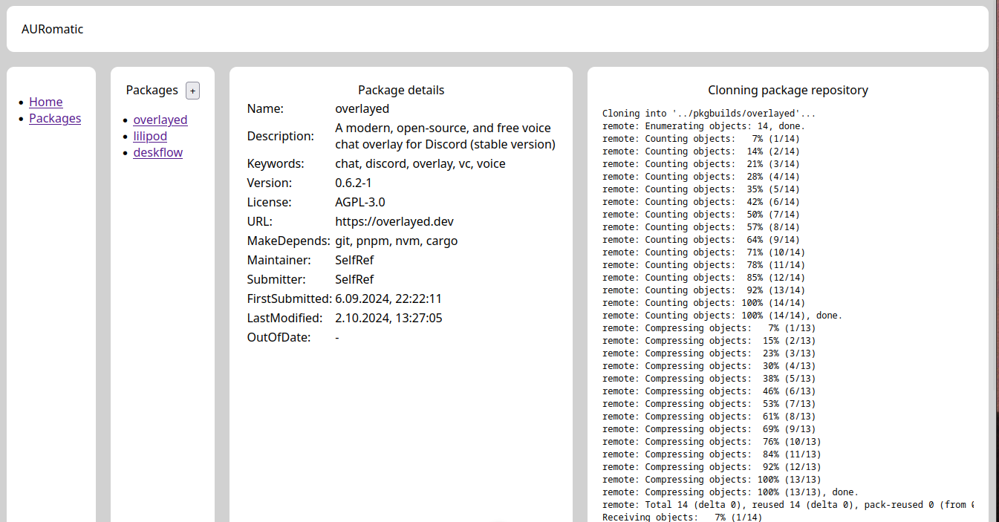

# AURomatic

Status: WIP

## Description

Management system for maintaining, updating, building and scheduling PKGBUILD packages on Arch User Repository.

## Features

- [x] Add existing package from AUR
- [x] Clone package from AUR
- [ ] Build package
- [ ] Edit package and send changes to AUR
- [ ] Upstream version lookup
- [ ] Schedule tasks (building, checking)
- [ ] Group packages (tags)
- [ ] Per package settings
